The folder is saved in the following public repository: https://github.com/EimenOueslati/eimeno-oppg1.git
# Pre-requisites (Windows)

In order to use the configuration files in the folder some software installations are recommended and/or necessary:

- **Visual Studio Code** (optional but very helpful): VScode is an integrated development environment that is very useful for editing configuration files. Some of its most helpful features are code completion, syntax highlight, large selection of useful extensions.

- **Chocolatey** (optional): Chocolatey is a package manager and installer for Windows. It makes the process of downloading and installing software very simple and will be useful in the next steps.

- **Terraform** (mandatory): Terraform is a IaC tool that uses a declarative langue which makes creating, managing, and destroying resources on cloud platforms simple and intuitive.

- **Azure CLI** (mandatory): "The Azure Command-Line interface (CLI) is a cross-platform command-line tool to connect to Azure and execute administrative commands on Azure resources." (Microsoft, 2023)

# Infrastructure Configuration

The folder contains multiple subfolders that describe the resources to be created when the files are executed. The configuration is structured as follows:

- **The root module** : This module is responsible for defining the required providers in addition to orchestrating the child modules and passing data from one module to the other. For our case we are passing the subnet id from the virtual network module to the virtual machine module to connect the VM to the subnet.
- **The storage account module:** This module includes the definition of a resource group, storage account, and a storage container. The storage account name in this module uses a random string from the random provider in terraform to create a unique name since the storage accounts in Azure are required to be globally unique.
- **The virtual network module:** This module defines the resource group for the virtual network as well as the network security group, virtual network, a single subnet, and an association to link the subnet and the security group. This module also contains and output file to output the subnet id to link it to the network interface card of the virtual machine.
- **The virtual machine module:** this module defines A resource group, the actual virtual machine, and the necessary components for the VM to function such as a network interface card, a public IP to connect to the VM.
- **The key vault module:** This module is used to create a key vault to store secrets and it defines a resource group, a key vault with the appropriate access policies, in addition to three secrets one for the storage account access key, one for the VM username, and one for the VM password. All the secrets are encrypted and not stored as plain text.

The following diagram is a high-level demonstration of the configuration structure:
 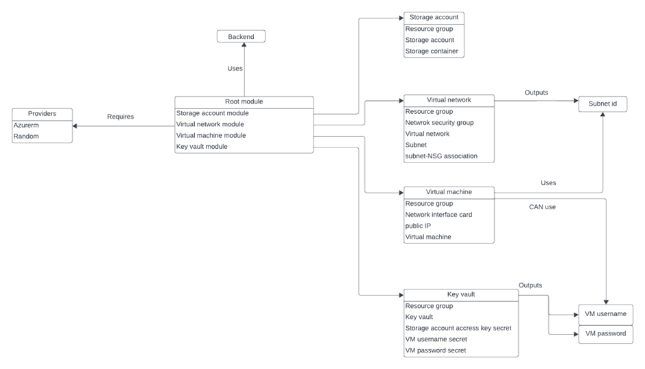

# Configuration Usage

In order to use the configuration files in the folder through VScode or other software, the pre-requisites marked mandatory above has to be met.

- The first step is to open the folder in VScode and open a terminal window.

- The second step is to execute the command "terraform init" which initializes the working directory that contains the configuration files. In addition, the command will initialize the selected backend. However, some credentials must be provided beforehand including the client id, client secret, tenant id, and subscription id. One way to do this is creating environment variables using the following commands (filling the quote marks with your own credentials):

    $env:ARM\_CLIENT\_ID = ""

    $env:ARM\_CLIENT\_SECRET = ""

    $env:ARM\_TENANT\_ID = ""

    $env:ARM\_SUBSCRIPTION\_ID = ""
    
    These environment variables are temporary and are valid for a single session.
    After executing the command, the following output should be received:

    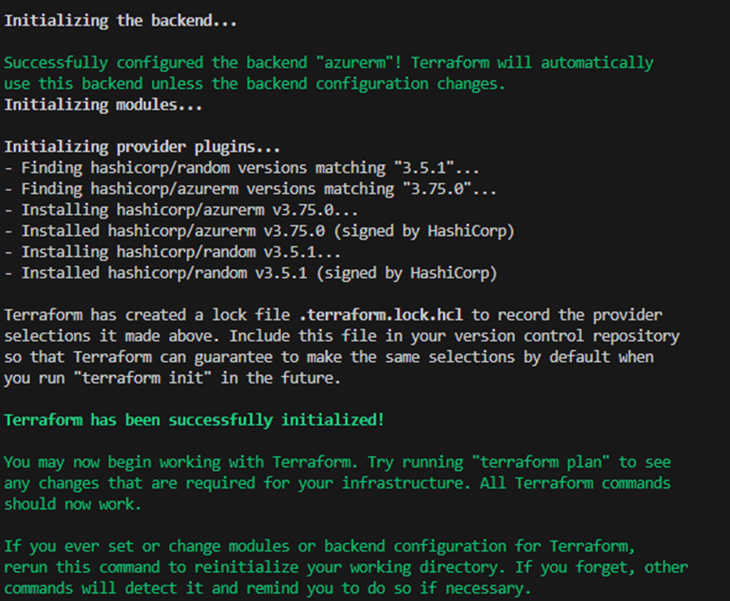

- The third step which is optional but good practice is to run the command "terraform fmt" which will format the configuration files and "terraform validate" which will check if the configuration is a valid one.

- The fourth step is to create an execution plan. This is done using the command "terraform plan" which will check for already existing remote resources and then comparing the current configuration to any existing resources. The command output will be a detailed list of the resources that are going to be created, changed, or destroyed. Optionally, which is a recommended practice, you can use the "-out=filename" option which will create a file and save the plan in it. During the planning phase you will be asked to input the values for any variables you are using in your configuration. Alternatively you can create a terraform.tfvars file and fill in the variable values there and terraform will automatically detect and take the variable values for the .tfvars file (it is important to not store this file in a repository as it might contain extremely sensitive data).

- The fifth step is to deploy the resources that you previously planed using the command "terraform apply" or "terraform apply plan\_file" if you opted for the -out option during the planning phase. This will initiate the deployment of the resources and might take few seconds to minutes depending on the resources you are deploying.

- After the resources are utilised and it is time to delete them, the command "terraform destroy" should be used for that. This command will destroy all resources managed by the current configuration. This command is just an alias for the command "terraform apply -destroy". However, in the key vault configuration the app does not have the permission to destroy the resources inside the vault, it only has the create, list, set, and get permissions. the delete and purge permission should be added in the config file, otherwise the vault must be destroyed manually using the Azure portal web interface.

# Deployed Resources

## The backend:

The backend used in this configuration is the one we were instructed to create in the weekly assignment during the lecture labs:
    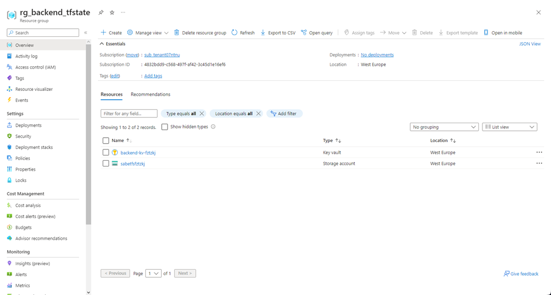

The tfstate file for the resources created is called "operraTerra.terraform.sfstate":
 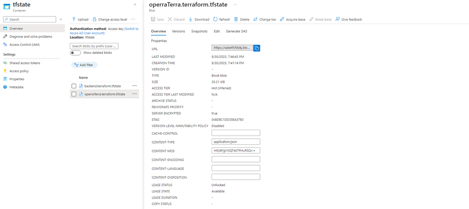

## The storage account:

The storage account module creates the following resources:

- Resource group called "SA-RG-OperaTerra":
    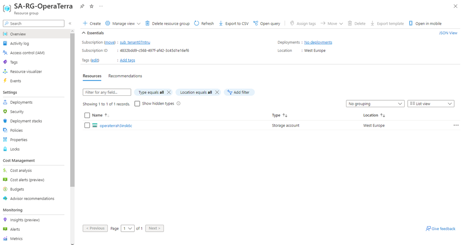

- Storage account with the name "operaterrah3insk6c":
    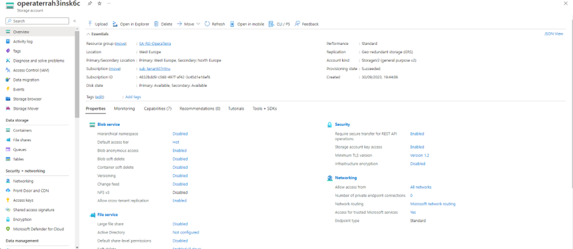
- Storage container with the name "sc-operaterra":
    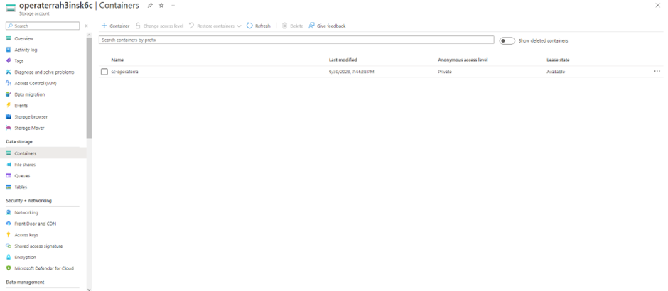

## Virtual network:

The virtual network module creates the following resources:

- A resources group with the name "VN-RG-operaterra":

    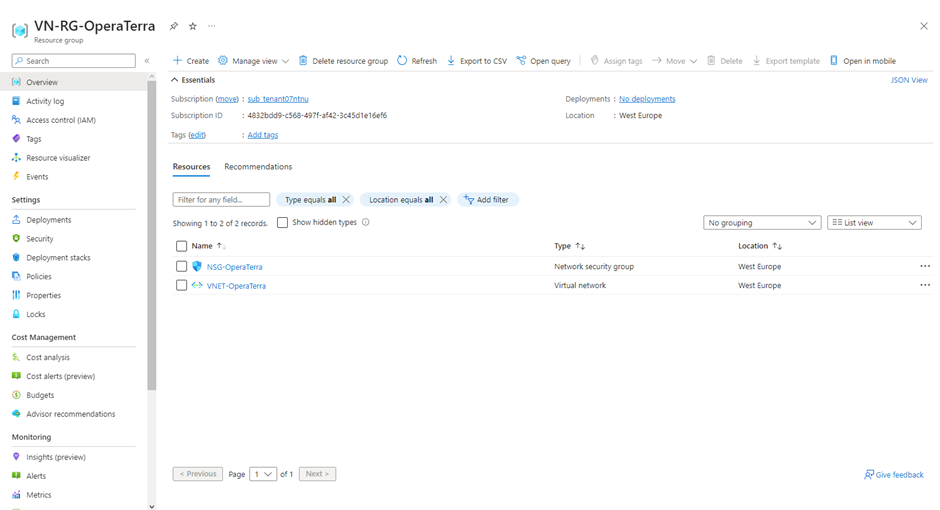

- A network security group with the name "NSG-operaTerra":
 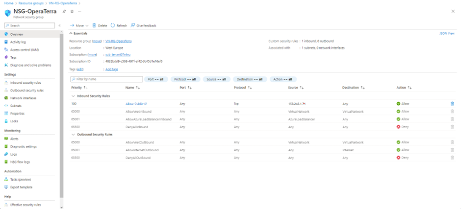
- A virtual network with the name "VNET-OperaTerra":
 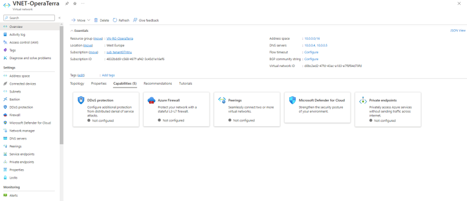

- A subnet with the name "subnet01-OperaTerra" that is associated with previous NSG:
 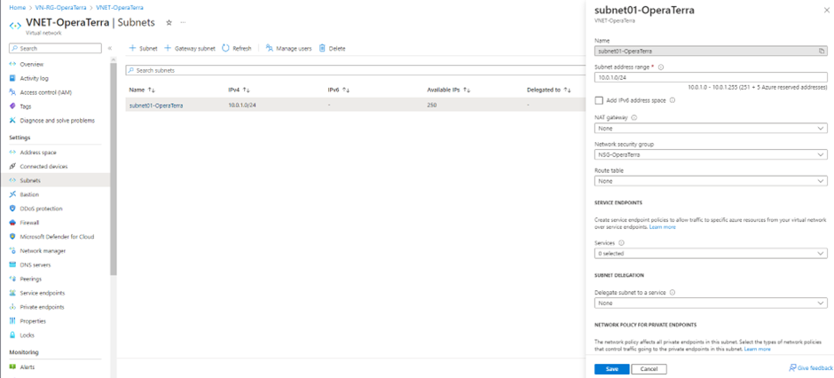

## Virtual machine:

The virtual machine module creates the following resources:

- A resource group with the name "VM-RG-OperaTerraf:

    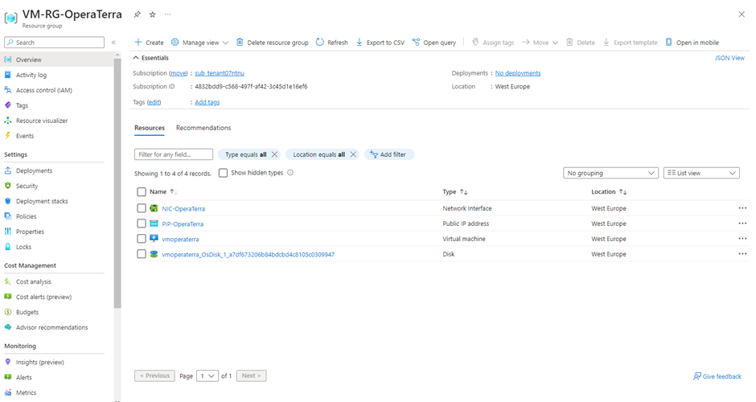

- A public IP address with the name "PIP-OperaTerra":
 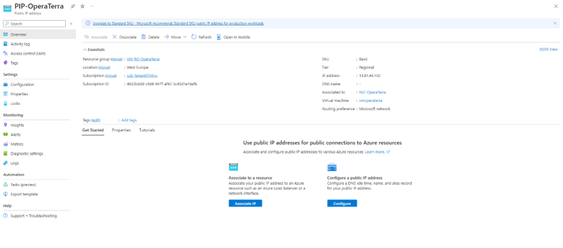
- A network interface card with the name "NIC-OperaTerra" that uses the previous public IP address:

    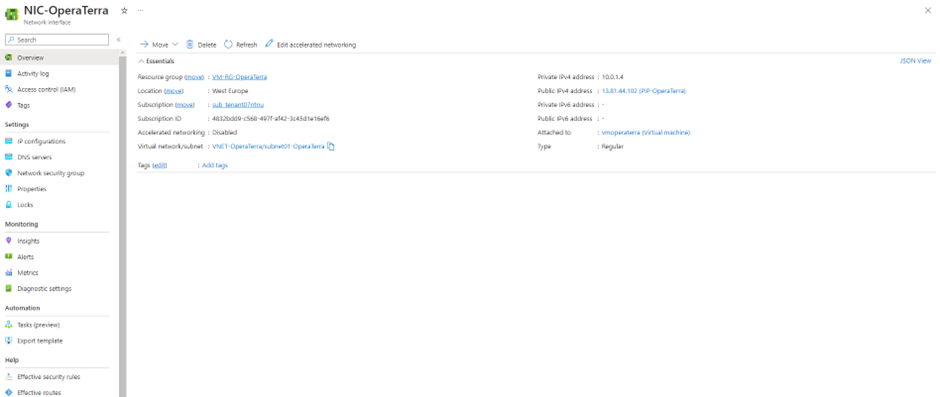

- A virtual machine with the name "vmoperaterra" that uses the previous NIC:

    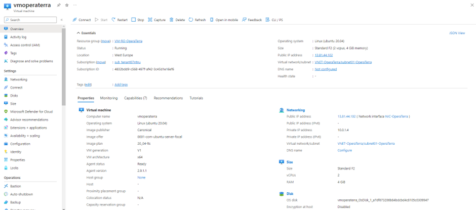

## The key vault

The key vault module creates the following resources:

- A resource group with the name "KV-RG-OperaTerra":
 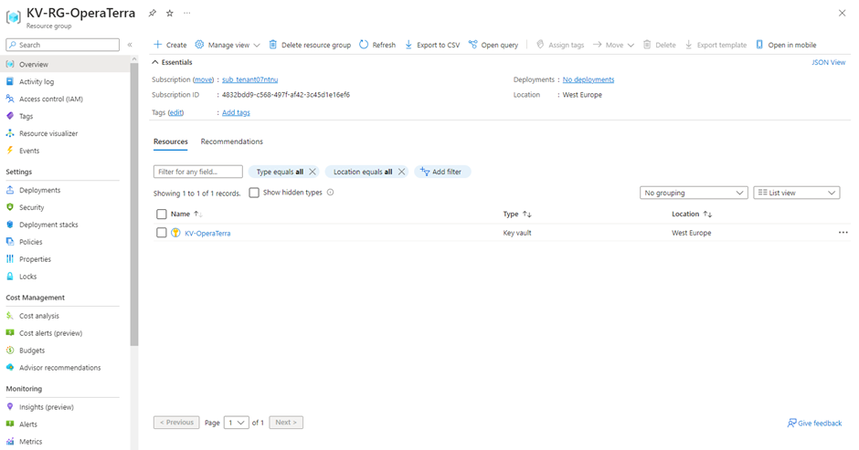
- A key vault with the name "KV-OperaTerra":
 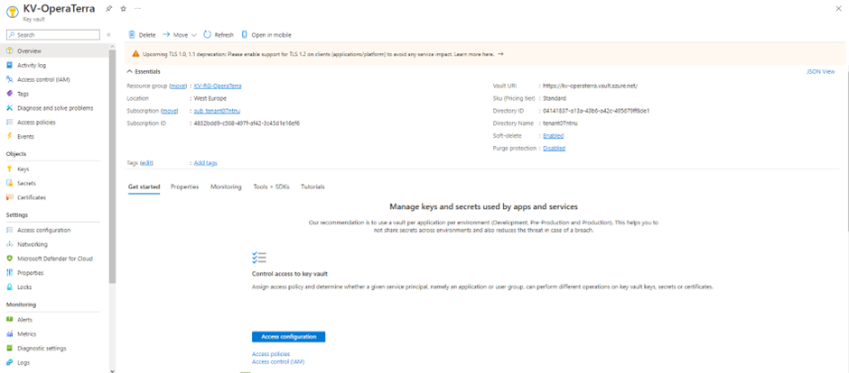

- Three secrets for the storage container access key, VM username, and VM password:

    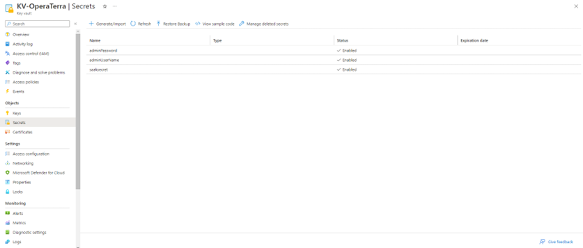

# Destruction of resources:

The destruction of resources is done by executing the command "terraform destroy" (the application was given the necessary access permission to destroy the key vault secrets).

 Before destruction:
    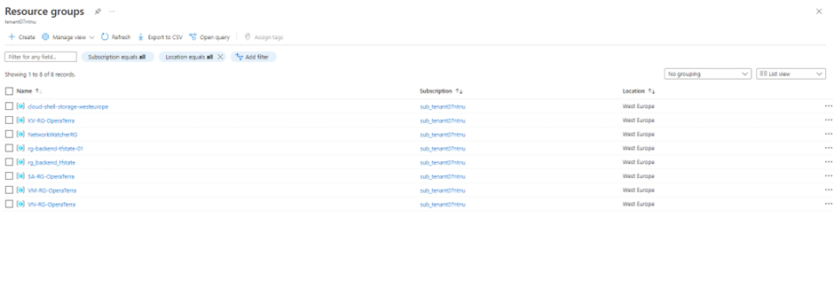

After destruction:

- Destruction confirmation in the command line interface:

    

- Deletion of resource groups from Azure portal:
    

# Design Choices and Rationale

Several choices went into making the configuration as flexible as possible, other choices were made to make the implementation of the configuration simpler.

## Flexibility choices:
- **Use of variables:** On of the most obvious yet most powerful choices for flexibility is the use of variables. It allows the configuration to be tailored to the need of specific use cases as well as reduce repetition and redundancy. Most common use cases of variables are base names for resources, locations, and resource names.
- **Use of modules:** The use modules allow the configuration to be more flexible in the sense that most modules, with some exceptions, are not strictly interdependent.
- **Use of local variables:** The use of local variables provides a lot of convenience as it reduces redundancy and increases consistency as well as providing quality of life options such as removing the need to search the documentation for field values (access permission, storage account types, VM sizes etc) but provide a preset list for those values.
- **Use of different resource group per module:** The use of a separate resource group per module offers mor granularity as resources can be created independently. For example, if a team has the need for only a subset of the resources in the configuration, or a duplicate of a certain resource, it is easy to created single resources form the individual modules.
- **Use of workspaces:** In the local variables the workspace name is set in the resource group. This will allow the same config files to be used in different workspaces which will ensure consistency when working in different environment like for example development, staging, and production environments.
-
## Simplicity choices:
- **Use of a single provider block:** The use of a single provider and backend block in the root module to avoid repeating the same information in every module. However, this might reduce flexible in the sense that if a single module is to be copied into a different folder to be used separately the provider and backend block must be manually copied in the main configuration file.